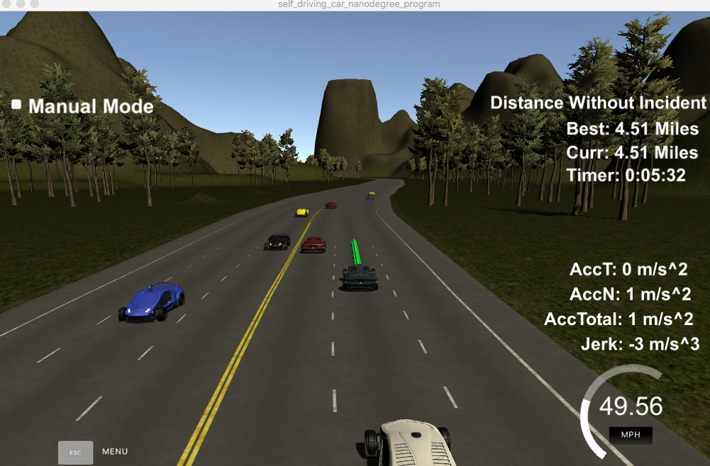

### Model Documentation
A walkthrough was given by Udacity for linear and circular paths to help get started on the project.

The path planner has to solve the remaining issues
1. Drive at least 4.32 miles without incident
2. Drive according to the speed limit
3. The car does not exceed a total acceleration of 10 m/s^2 and a jerk of 10 m/s^3.
4. No collisions
5. Change lane ability
6. The car stays in its lane, except for the time between changing lanes.

### Finding next waypoints
Refer to line 255 till 265. The variable prev_size has information for the size of the path points in the path planner. The code is use to generate the next_waypoints based on the sizes of the prev_size once it is greater than 2.

### Check for another vehicles in current lane
Refer to line 275 till 283. The variable d contains frenet d value from the sensor_fusion data. This value follows the centerline of each lane and can be used to compare the positions of other vehicles to the dummy vehicle.

## Slowing down the dummy vehicle
Refer to line 285-295. Once a vehicle is in front, the dummy car's speed has to be adjusted and the flag to change lane is set to true.

## Changing lanes to left or right
Refer to line 300 till 355. To execute a change to left or right, a check is done to see the lane is empty by reading the sensor fusion data. 

###  Results
